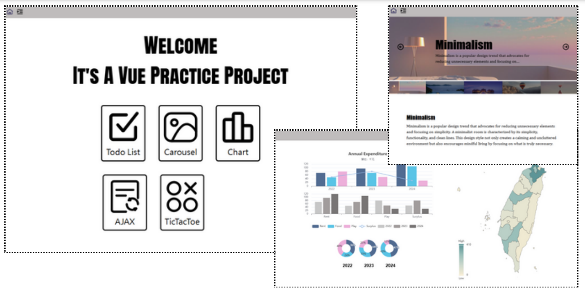
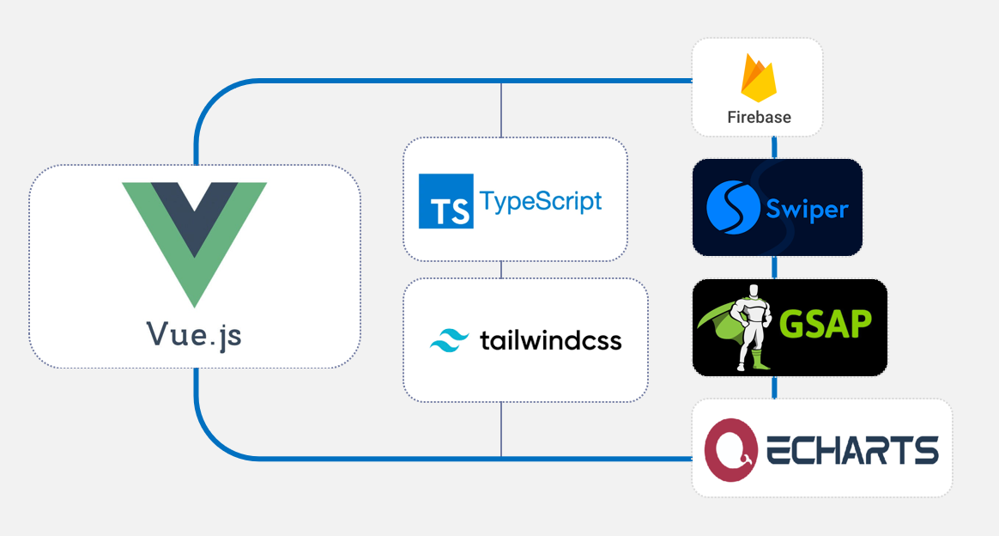

### Introduction

使用 Vue 搭配框架 Vite，結合 TypeScript 及 Tailwind CSS，  
應用 常見的前端套件，實作畫面呈現。

### Components

- Todo List：簡單的待辦清單小功能，  
  內容可編輯、拖曳、勾選等，並結合 Firebase 作資料儲存。
- Carousel：使用 Swiper 應用圖片輪播。
- Chart：使用 ECharts 呈現資料圖表。
- AJAX：連結 TMDB 影視網，呈現近期熱門作品清單。
- TicTacToe：來一個經典的圈圈叉叉小遊戲。

